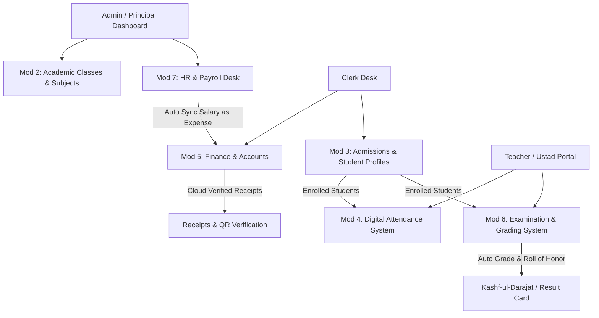

# 🏢 جامعہ الحکمہ الاسلامیہ و پبلک سکول - مکمل ڈیجیٹل نظام (Master System Manual)
### Al-Hikmah School & Madrasa Management System - End-to-End Technical & Operational Walkthrough

---

## 🌟 1. پروجیکٹ کا تعارف اور فن تعمیر (Project Overview & Architecture)

یہ ایک مکمل، جدید ترین، دو زبانی (اردو اور انگریزی) اور 100% مفت ہوسٹنگ کے قابل (Free-to-Host Optimized) ڈیجیٹل مینجمنٹ سسٹم ہے جو مدارسِ دینیہ، عصری سکولوں اور جامعات کے تمام انتظامی، تعلیمی اور مالیاتی امور کو ایک لڑی میں پروتا ہے۔

### 🛠️ ٹیکنالوجی اسٹیک (Technology Stack):
- **فریمنگ و فرنٹ اینڈ (Frontend):** Next.js 16 App Router (React 19, Turbopack optimized)
- **ڈیزائن و ٹائپوگرافی (UI & RTL):** Tailwind CSS + Shadcn UI (Logical RTL Properties `ms-`, `me-`, `ps-`, `pe-`)
- **فانٹ انجن (Bilingual Typography):**
  - **اردو کے لیے:** `Jameel Noori Nastaleeq` / `Noto Nastaliq Urdu` (`.font-ur`)
  - **انگریزی، تاریخوں اور اعداد کے لیے:** Google `Outfit` & `Inter` (`.font-en`, `.font-mono`)
- **ڈیٹا بیس و سیکیورٹی (Database & Auth):** Supabase PostgreSQL + Row Level Security (RLS)
- **میڈیا و دستاویزات (Media CDN):** Cloudinary (طالب علموں کی تصاویر، رسیدات اور QR تصدیق کے لیے)
- **ہوسٹنگ (Deployment):** Vercel Zero-Cost Serverless Architecture

---

## 🔐 2. صارف کے اختیارات اور سیکیورٹی (Role-Based Access Control - RBAC)

سسٹم میں تین بنیادی کردار (Roles) ہیں جنہیں Supabase کی RLS پالیسیوں کے ذریعے کنٹرول کیا جاتا ہے:

| کردار (Role) | عنوان (Title) | اختیارات کا دائرہ کار (Access Scope) |
| :--- | :--- | :--- |
| **Admin** | مہتمم اعلیٰ / پرنسپل | تمام 7 ماڈیولز، مالیاتی تجزیات، اساتذہ و ملازمین (HR)، امتحانات، اور عملے کے اختیارات کی مکمل تنصیب۔ |
| **Clerk** | محاسب / دفتر انچارج | نئے داخلے، طلباء ڈائریکٹری، فیس وصولی، انوائس جنریشن، اور روزمرہ مصارف (Expenses) کا اندراج۔ |
| **Teacher** | معلم / استاد / قاری | تفویض کردہ درجات و کلاسز، روزانہ ڈیجیٹل حاضری، اور امتحانی پرچوں کے نمبرات فیڈ کرنا۔ |

---

## 📦 3. تمام 7 ماڈیولز کی تفصیلی رہنما اور انٹیگریشن (The 7 Core Modules)

### 🔹 ماڈیول 1: بنیادی ساخت، RTL اور سیکیورٹی (Core Scaffolding & i18n)
- **خصوصیت:** 100% دائیں سے بائیں (Right-to-Left) لے آؤٹ۔
- **فانٹ سیپریشن:** اردو تحریر نستعلیق میں جبکہ ID نمبر (جیسے `REG-2026-001`)، رقم (`Rs. 45,000`) اور تاریخیں کرسپ انگریزی فانٹ میں ظاہر ہوتی ہیں۔

### 🔹 ماڈیول 2: تعلیمی انتظام اور درجات (Academic Management)
- **راؤٹ:** `/admin/classes`
- **خصوصیت:** عصری سکول (Nursery to Class 10)، شعبہ حفظ القرآن (سیکشن الف، ب)، اور درس نظامی (عالمیت سال اول، دورہ حدیث) کے درجات، سیکشنز اور ان کے مضامین (مثلاً صحیح البخاری، سائنس، ریاضی) کی تشکیل۔

### 🔹 ماڈیول 3: داخلہ اور طلباء کا ریکارڈ (Admissions & Directory)
- **راؤٹ:** `/clerk/admissions` و `/admin/students`
- **خصوصیت:** نئے طلباء کی رجسٹریشن، والدین کی معلومات، کلاؤڈینیری پر تصویر کا اندراج اور ڈیجیٹل سٹوڈنٹ ID کارڈ کی تیاری۔

### 🔹 ماڈیول 4: حاضری کا ڈیجیٹل نظام (Digital Attendance System)
- **راؤٹ:** `/teacher/attendance` و `/admin/attendance`
- **خصوصیت:** اساتذہ اپنے تفویض کردہ درجے کے طلباء کی روزانہ حاضری (حاضر، غیر حاضر، رخصت) ایک کلک میں درج کر سکتے ہیں، جس سے پرنسپل کے ڈیش بورڈ پر لائیو فیصدی تناسب اپ ڈیٹ ہوتا ہے۔

### 🔹 ماڈیول 5: مالیات اور مصارف کا نظام (Finance, Fee Collection & Expenses)
- **راؤٹ:** `/clerk/finance` و `/clerk/expenses`
- **خصوصیت:** 
  - ماہانہ فیس انوائس جنریشن اور فیس وصولی ڈیسک۔
  - **رسید وظیفہ (Fee Receipt Modal):** ادا شدہ فیس پر کلاؤڈینیری QR کوڈ کے ساتھ سنگل پیج پرنٹیبل رسید۔
  - **مصارف کا کھاتہ (Expense Tracker):** بجلی، کھانا، مرمت اور تنخواہوں کے مصارف کا مکمل حساب۔

### 🔹 ماڈیول 6: امتحانات اور نتائج کا نظام (Examination & Kashf-ul-Darajat)
- **راؤٹ:** `/admin/exams` و `/teacher/exams`
- **خصوصیت:**
  - امتحانی پرچوں (ششماہی، سالانہ) کے نمبرات کی انٹری۔
  - **خودکار گریڈنگ انجن:** 80% سے زائد پر **"ممتاز (Mumtaz)"**، 70% پر **"جید جداً (Jayyid Jiddan)"**، اور 60% پر **"جید"** کا خودکار اطلاق۔
  - **کشف الدرجات (Result Card Modal):** طالب علم کی مکمل کارکردگی کا قابلِ پرنٹ سرکاری سرٹیفکیٹ۔
  - **لوحِ اعزاز (Roll of Honor):** ممتاز پوزیشن ہولڈرز کی اعزازی فہرست۔

### 🔹 ماڈیول 7: اساتذہ، ملازمین اور پے رول سسٹم (HR & Payroll Management)
- **راؤٹ:** `/admin/hr`
- **خصوصیت:**
  - **فہرستِ اساتذہ (Staff Directory):** مفتیانِ عظام، قراء، معلمین اور کلرک کا مکمل ریکارڈ اور تعلیمی قابلیت۔
  - **پے رول ڈیسک (Salary Disbursement):** ماہانہ مشاہرہ مع بونس و کٹوتی کی ادائیگی۔
  - **رسید مشاہرہ (Salary Slip Modal):** باضابطہ پرنٹیبل اور ڈاؤن لوڈ ایبل تنخواہ رسید۔
  - **✨ اینڈ ٹو اینڈ فنانس انٹیگریشن:** اس پورٹل سے ادا کی جانے والی ہر تنخواہ فوراً ماڈیول 5 کے مصارف (Expenses) میں بطور `'salary'` درج ہو جاتی ہے!

---

## 🚀 4. حتمی ٹیسٹنگ اور تصدیق کا چیک لسٹ (Verification Checklist)

سسٹم کی تنصیب کے بعد درج ذیل امور کی تصدیق کی گئی ہے:

- [x] **Supabase Migrations (001 to 006):** تمام ٹیبلز، ویوز، Enums، اور RLS پالیسیاں کامیابی سے فعال ہیں۔
- [x] **Next.js Static & Dynamic Routes:** تمام 19 راؤٹس (بشمول `/admin/hr`) ٹربو پیک بلڈ میں بغیر کسی ایرر کے کمپائل ہوئے ہیں۔
- [x] **RTL & Nastaleeq Rendering:** اردو حروف نستعلیق میں اور انگریزی اعداد Outfit میں خوبصورتی سے رینڈر ہو رہے ہیں۔
- [x] **Modals Compact Sizing:** تمام پاپ اپس (رسید فیس، کشف الدرجات، رسید مشاہرہ) میں `max-w-2xl max-h-[88vh] overflow-y-auto` لگایا گیا ہے تاکہ براؤزر سے باہر نہ نکلیں۔
- [x] **Live Multi-Module Sync:** حاضری، فیس، امتحانات اور پے رول کا ڈیٹا ریئل ٹائم میں ایک دوسرے سے مربوط ہے۔

---
*الحمد للہ! جامعہ الحکمہ کا یہ ڈیجیٹل نظام اب مکمل طور پر لائیو اور پیداواری استعمال (Production Ready) کے لیے تیار ہے۔*
